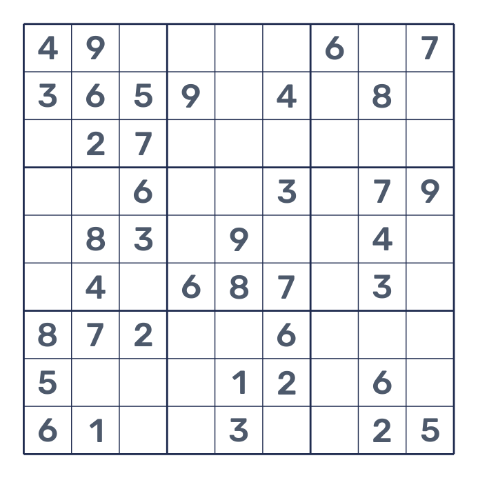

<h1 align="center">Namishu Sudoku</h1>

<p align="center">Printable Sudoku puzzles, ready for a quiet moment.</p>

<p align="center">
  
  <a href="LICENSE"></a>
  
</p>

<p align="center"><strong>English</strong> · <a href="README.zh-CN.md">简体中文</a></p>

<p align="center">
  <a href="examples/sudoku.pdf"></a>
</p>

Namishu Sudoku is a small command-line tool that creates printable Sudoku puzzles.
Choose a difficulty and page count to get an A4 PDF with two puzzles per page and
room to fill in the numbers by hand. Use it to prepare classroom activities,
share a puzzle at home, or take a few pages along on a trip.

You can generate fresh puzzles whenever you need them, without searching for
worksheets or arranging screenshots on a page. Each puzzle has exactly one solution.
For practice with a way to check your work, enable answers: the top half contains a
puzzle and the bottom half contains its completed grid.

<p align="center">
  Sample PDFs: <a href="examples/sudoku.pdf">Two-puzzle worksheet</a> · <a href="examples/sudoku-answers.pdf">Puzzle–solution worksheet</a>
</p>

## Installation

Requires **Python 3.10+**. Install with uv or pip:

```bash
uv tool install namishu-sudoku
```

```bash
python -m pip install namishu-sudoku
```

Both methods provide the `namishu-sudoku` command. The default layout and Rubik
Regular and Medium fonts are included, so no separate font installation is needed.

## Quick start

Generate **one page with two easy puzzles**, saved as `sudoku.pdf`:

```bash
namishu-sudoku
```

Generate five pages of harder puzzles, ten puzzles in total:

```bash
namishu-sudoku --level hard --pages 5
```

Place an answer below each puzzle. This produces five pages with five puzzles and
their answers:

```bash
namishu-sudoku --level hard --pages 5 --answers
```

Choose an output path and a seed to reproduce the puzzle content:

```bash
namishu-sudoku --level normal --seed 42 -o exercises/practice.pdf
```

The command prints the saved file location and page count. Relative paths are
resolved from your current directory, and parent directories are created as needed.
An existing output PDF is replaced after the new document is written successfully.
You can also run `python -m namishu_sudoku`.

Print at actual size on A4 paper; fold along the divider to keep the answer out of sight.

## Options

| Option | Purpose | Default |
|---|---|---|
| `--level LEVEL` | `easy`, `normal`, or `hard` | `easy` |
| `--pages N` | PDF page count; a positive integer | `1` |
| `--answers` | Put each puzzle's solution in the lower half of the same page | Off |
| `-o, --output PATH` | PDF file location | `sudoku.pdf` |
| `--seed INTEGER` | Reproduce puzzle content with the same settings and version | Random |
| `--config PATH` | YAML overrides for layout and font | Built-in settings |
| `--help` | Show usage | |
| `--version` | Show the installed version | |

Answers are omitted by default. Without answers, every page contains two puzzles;
with answers, every page contains one puzzle and its answer, with the original clues in muted bold gray and the filled-in answers in a muted teal.
A seed reproduces puzzles with the same version and settings, not the exact PDF file bytes.

## Difficulty

Choose one of three levels. Every puzzle has a unique solution and can be completed
using the logical techniques allowed for its level, without guessing:

| Level | Solving techniques |
|---|---|
| `easy` | A cell has only one possible number, or a number has only one possible place in a row, column, or box |
| `normal` | Easy techniques, plus locked candidates and naked pairs |
| `hard` | Normal techniques, plus hidden pairs, naked triples, and X-Wing |

A normal puzzle must make the easy strategy stall; a hard puzzle must make the
normal strategy stall. Ratings follow this tool's fixed technique order and may
differ from other Sudoku apps. The number of given digits varies and does not
determine the rating. Hard puzzles can take longer to generate. If no matching
puzzle is found within the bounded search, the command reports an error and keeps
any existing output PDF; it never silently substitutes an easier puzzle.

## Customize the layout

Write only the settings you want to change. For example, save this as `sudoku.yaml`
to use smaller numbers:

```yaml
numbers:
  font_size: 22
```

```bash
namishu-sudoku --config sudoku.yaml
```

Unspecified settings keep their defaults, including the bundled font. The
[complete example configuration](https://github.com/namishu/sudoku/blob/main/examples/sudoku.yaml) lists every setting and
works as downloaded.

| Setting | How to customize it |
|---|---|
| Paper and margins | `page`: width, height, and a uniform margin (`margin`) |
| Board | `board`: width, vertical gap between boards (`gap`), line color |
| Numbers | `numbers`: font size, puzzle clue color (`color`), muted answer clue color (`answer_given_color`), and filled-in answer color (`answer_color`) |
| Dashed middle divider | `separator`: visibility and color |
| Custom fonts | `font`: filled-in answers; `bold_font`: given clues; both are TrueType file paths |

Distances are in millimeters; font sizes are in points. `board.gap` defaults to 30 mm,
measured between the outer edges of the two board borders. `page.margin` applies to all four sides.
Grid line weights and the divider’s dash pattern are fixed for consistent printing. Boards are placed symmetrically
in the usable page area and centered horizontally, without labels or a footer. Quote hex colors, such as `"#1f2c50"`.
Unknown settings, invalid values, or layouts that cannot fit the content produce an
error before an existing PDF is replaced.

For custom fonts, add `font: fonts/MyFont-Regular.ttf` and
`bold_font: fonts/MyFont-Medium.ttf` to the YAML file. Both paths are relative to that
file, or they can be absolute. Unspecified fonts keep their bundled defaults.
Fonts are embedded in the PDF; unreadable fonts or missing digits produce an error.
Given clues use the bold font in both the puzzle and its solution. Only numbers
filled into originally empty cells use the regular font and answer color.

## License

Code and original documentation use the [MIT License](https://github.com/namishu/sudoku/blob/main/LICENSE).
The bundled Rubik Regular and Medium fonts use the [SIL Open Font License 1.1](https://github.com/namishu/sudoku/blob/main/src/namishu_sudoku/data/OFL.txt);
that file also includes its attribution and source information.
Generated puzzles may be printed, shared, modified, and sold.
